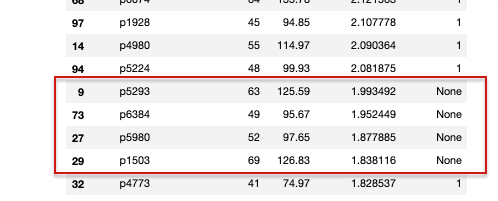

# The Task
The task is to place **products** into the **fixture**, maximizing product profit subject to the usual knapsack problem constraints:

-   **0/1 constraint:** there must be either zero or one of each product on the shelves
-   **shelf capacity constraint:** the sum of the product widths must not exceed the shelf width

`planogram.py` contains a minimal implementation.

To proceed:

1.  clone this repository
2.  **working on a new branch**, complete the implementation of `planogram.py:planogram()`.
    You are free to use your choice of additional libraries;
    make sure to update `pyproject.toml` / `requirements.txt` as necessary.
3.  get the code back to us:
    -   **private** repository on bitbucket (preferred) github, etc, or
    -   zip/tar project files and email us
    
    
# Our Solution

- We'll start shelving products according to their `profit_per_mm`, as that allows us to maximise the space on our shelves to earn the most profit.

- After that we will create a function that will permutate the order of the shelves. That function will compare the profits made by each permutation and pick the the most profitable one to generate our results. 

# After Action Analysis 

- **Profitability** - Our shelves contain products with a total profit of 19124.06, out of a maximum possible profit of 21732.75.

- **Free space left** - Based on the items sitting on the shelf in our solution, we have a collective 16mm of free space left. 

- **The ones that got away** -  Our function has maximised `profit_per_mm`, except for the four items shown above, which has higher `profit_per_mm` compared to the final item that made it onto a shelf, p4773. As we have only 16mm of space left, we can only reasonably consider adding two of these four items onto the shelf to increase profitability.

- **Future improvements** - Although, we'd like to believe that we've come up with the best possible scenario, the fact that we have left empty space on the shelves means that there just might be better ways of maximising profitability!
